# Week 0 — Billing and Architecture

## For the Week 0, I learnt quite a number of things, about new aws services, how to make a diagram on LUCID and napkin diagrams

# Create the cruddur logical diagram
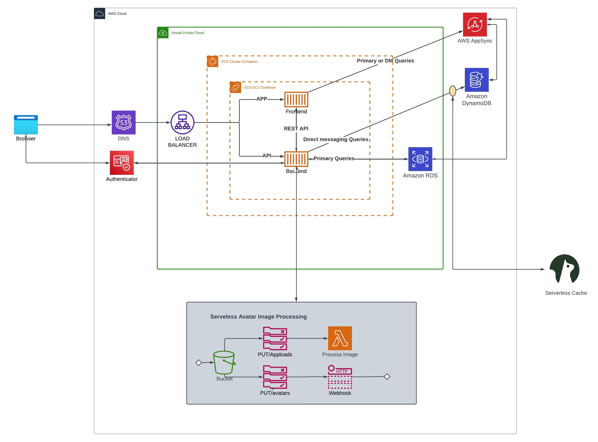

## The above architectural diagram is the Cruddur app diagram

## Below is a napkin diagram of a vpc with two public public subnets and two private subnets, with a NATs gateway in the public 
## subnets and a load balancer to regulate traffic

***

# Setting up a billing alarm
## step 1: Login to your aws account. On the console page click on the downward pointing triangle on the top right corner
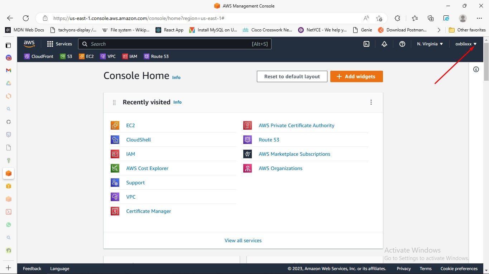
## step 2: A box appears, then click on "Billing Dashboard"
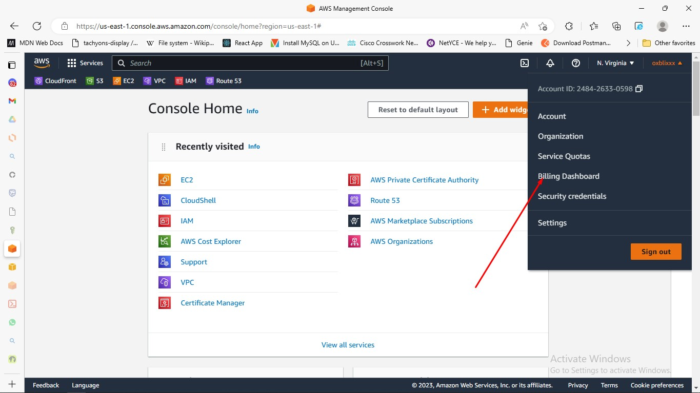
## step 3: Thereafter the AWS Billing Dashboard appears. On the left hand side, click "Budgets"
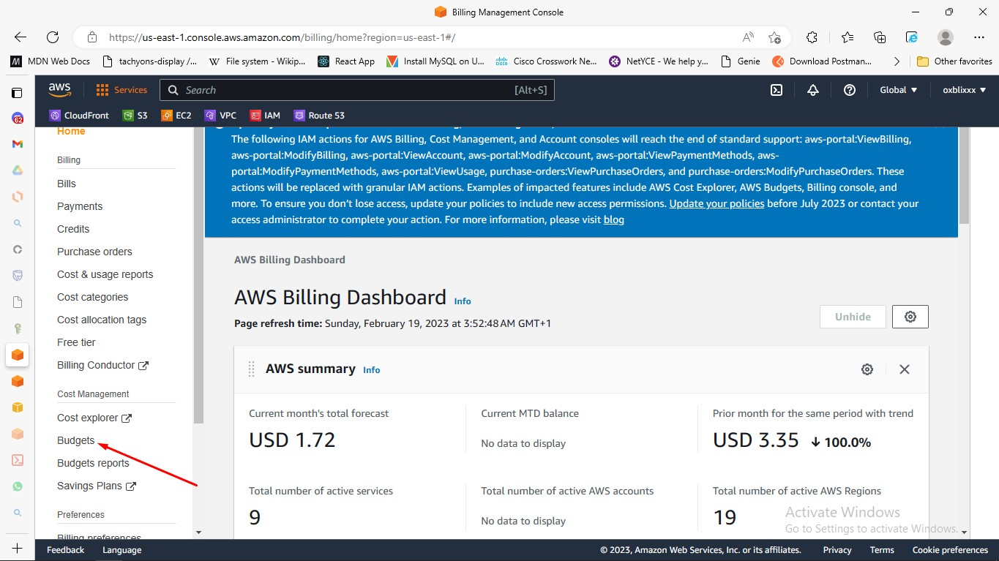
## step 3: Click on "Create a budget"
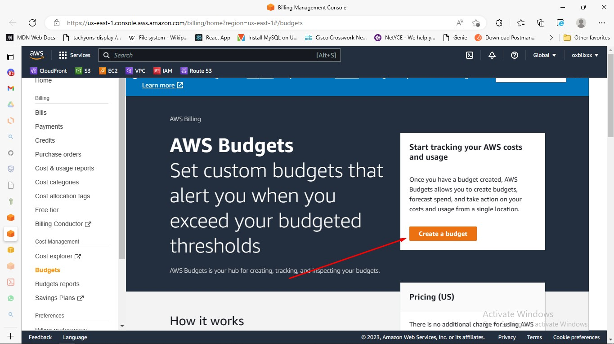
## step 4: We can use the AWS default template(simplified). Chooe Zero spend budget.
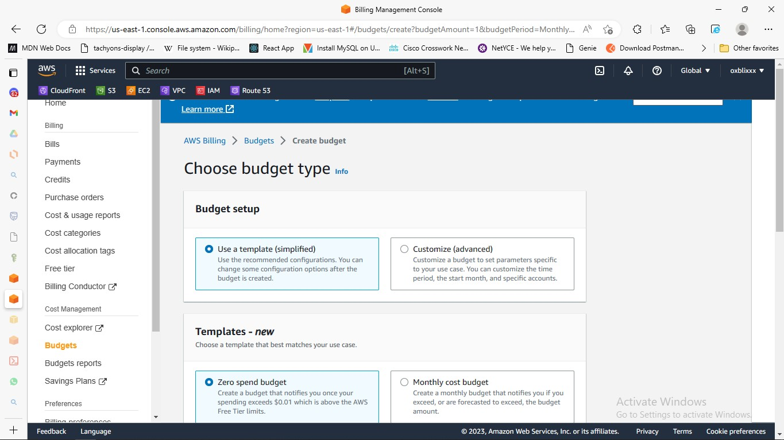
## step 5: Type in our preferred Budget name, Email recipients
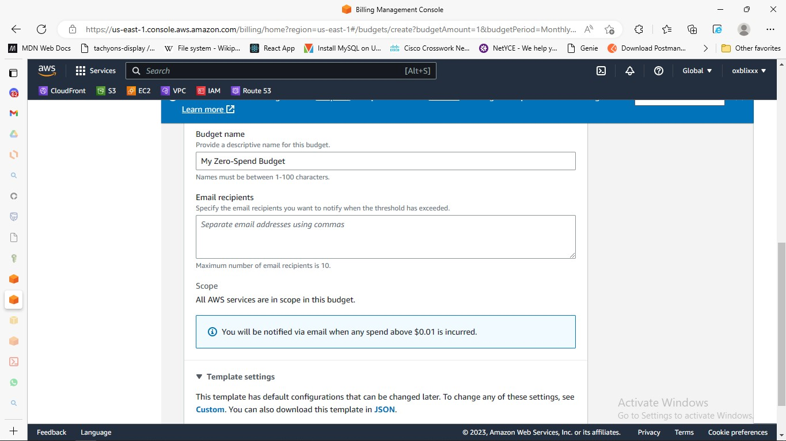
## step 6: Then click on "Create Budget"
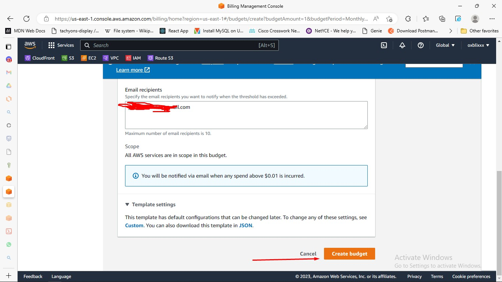
## step 7: Tadaaaaaa, we created our first Billing alarm, but we have gone beyond the threshold already
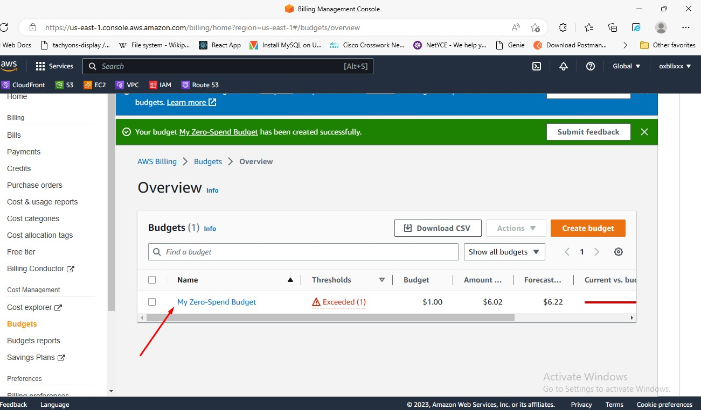
***
# Create a AWS BUDGET
## Follow steps above up to step 3
## step 4: We can use AWS default template, choose Monthly Cost Budget
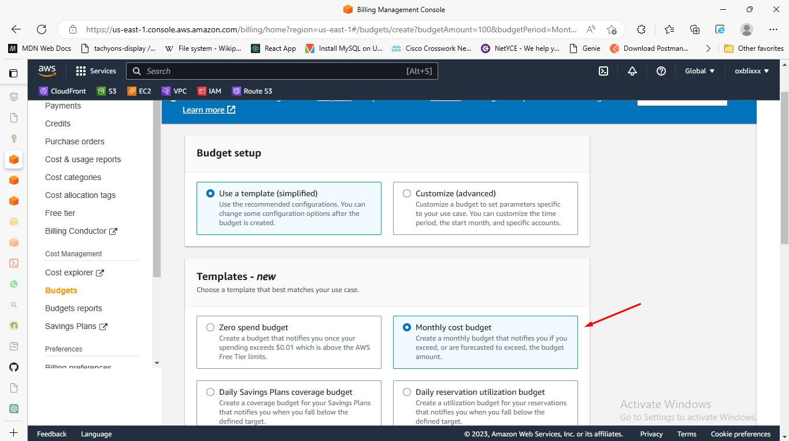
## step 5: Type in our preferred Budget Name, budgeted amount and email recipients
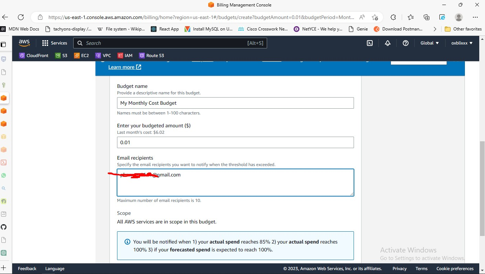
## Then Click Create Budget
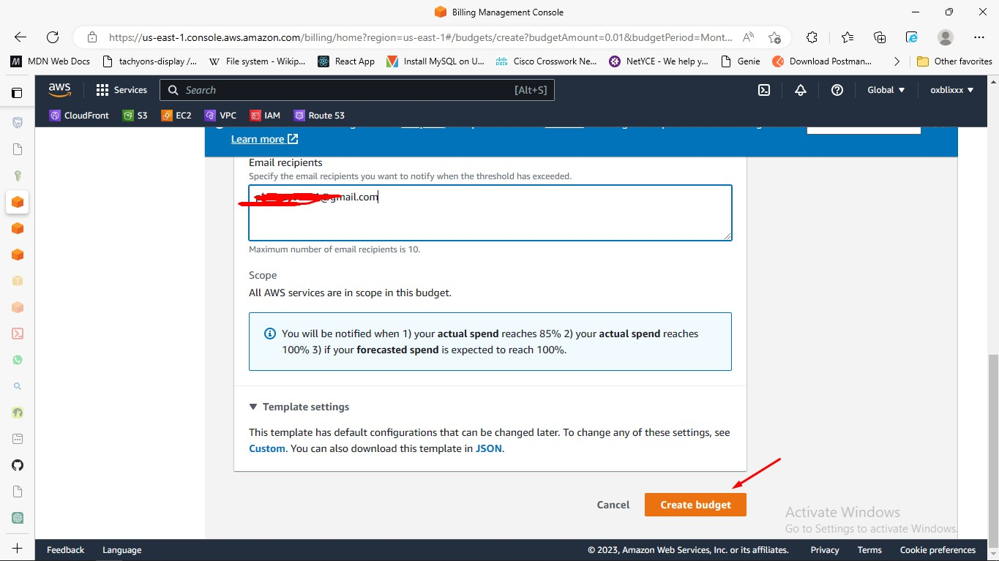
***
# Generate AWS Credentials
## step 1: Login to your AWS console, on the searchbox type IAM then click enter

## step 2: Scroll down to the Access Keys section, click Create access keys

## step 3: choose Command Line Interface(CLI)

## step 4: Confirm that you understand and click on Next

## step 5: It's best practices to put in a description value, then click Create Access Key

## step 6: You can decide to download the .csv file, click done

***

