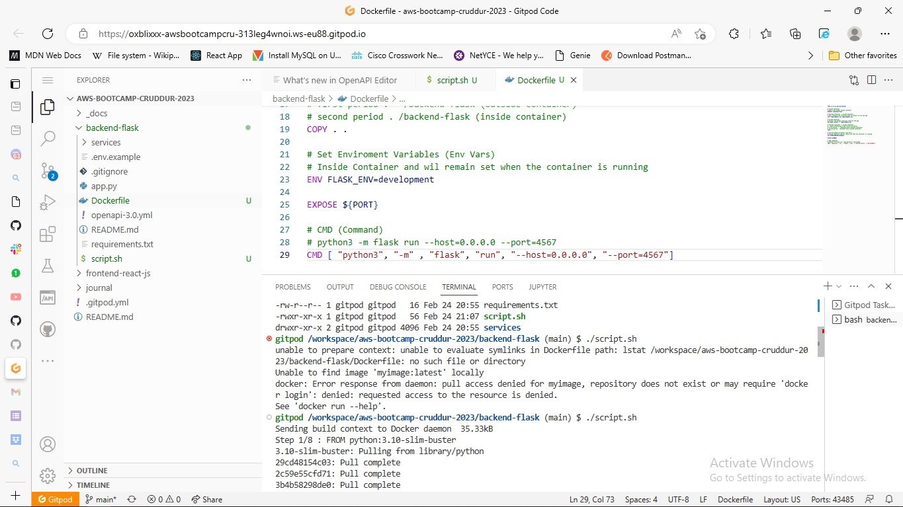

# Week 1 — App Containerization

## Homework challenge

## Run the dockerfile as a script
I firstly created the Dockerfile in the backend-flask directory, here is the code:
```Dockerfile
FROM python:3.10-slim-buster

# Inside Container
# make a new folder inside container
WORKDIR /backend-flask

# Outside Container -> Inside Container
# this contains the libraries want to install to run the app
COPY requirements.txt requirements.txt

# Inside Container
# Install the python libraries used for the app
RUN pip3 install -r requirements.txt

# Outside Container -> Inside Container
# . means everything in the current directory
# first period . - /backend-flask (outside container)
# second period . /backend-flask (inside container)
COPY . .

# Set Enviroment Variables (Env Vars)
# Inside Container and wil remain set when the container is running
ENV FLASK_ENV=development

EXPOSE ${PORT}

# CMD (Command)
# python3 -m flask run --host=0.0.0.0 --port=4567
CMD [ "python3", "-m" , "flask", "run", "--host=0.0.0.0", "--port=4567"]
```
We need to a create script file with commands to run the script from the located directory
In the **script file** put in the below code
```sh
#!/bin/bash
docker build -t backend-flaskimage .
docker run backend-flaskimage
```

then in the current directory run the below linux file directory command to make it executable
```
chmod +x <name of the file>.sh
```

in the directory of the script file run:
```
./<name of the file>.sh
```
the script builds the image then runs it.



I repeated the same process in the frontend-react-js directory


## Push an Image to dockerhub
Prior before now, I had a dockerhub account but I haven't pushed to the hub before.

If you don't have a Dockerhub account create one [here](https://hub.docker.com)

return to your terminal, run

```
docker login
```

put in your credentials. If correct it should log you in succesfully
