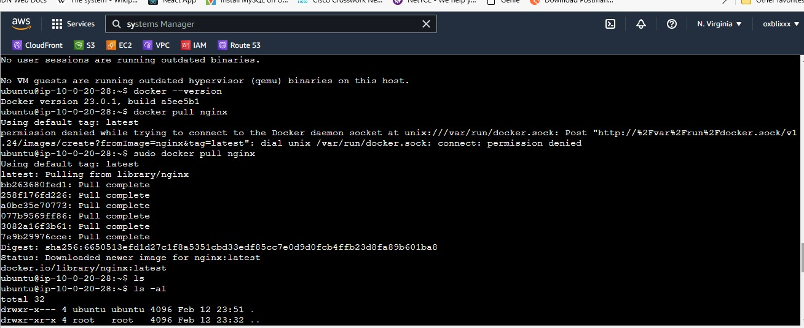

# Week 1 — App Containerization

## Homework challenge

***
## Run the dockerfile as a script
I firstly created the Dockerfile in the backend-flask directory, here is the code:
```Dockerfile
FROM python:3.10-slim-buster

# Inside Container
# make a new folder inside container
WORKDIR /backend-flask

# Outside Container -> Inside Container
# this contains the libraries want to install to run the app
COPY requirements.txt requirements.txt

# Inside Container
# Install the python libraries used for the app
RUN pip3 install -r requirements.txt

# Outside Container -> Inside Container
# . means everything in the current directory
# first period . - /backend-flask (outside container)
# second period . /backend-flask (inside container)
COPY . .

# Set Enviroment Variables (Env Vars)
# Inside Container and wil remain set when the container is running
ENV FLASK_ENV=development

EXPOSE ${PORT}

# CMD (Command)
# python3 -m flask run --host=0.0.0.0 --port=4567
CMD [ "python3", "-m" , "flask", "run", "--host=0.0.0.0", "--port=4567"]
```
We need to a create script file with commands to run the script from the located directory
In the **script file** put in the below code
```sh
#!/bin/bash
docker build -t backend-flaskimage .
docker run backend-flaskimage
```

then in the current directory run the below linux file directory command to make it executable
```
chmod +x <name of the file>.sh
```

in the directory of the script file run:
```
./<name of the file>.sh
```
the script builds the image then runs it.


I repeated the same process in the frontend-react-js directory

***
## Push an Image to dockerhub
Prior before now, I had a dockerhub account but I haven't pushed to the hub before.

If you don't have a Dockerhub account create one [here](https://hub.docker.com)

return to your terminal, run

```
docker login
```

put in your credentials. If correct it should log you in succesfully


then return to the browser you have your dockerhub logged in, create a repo [here is my repo link](https://hub.docker.com/repository/docker/oxblixxx/backend-flask/general)

then I returned to my terminal to run this command to tag the image firstly
```
docker tag backendflask-image:1.0 oxblixxx/backend-flask:1.0
```
then I ran the below command to push
```
docker push oxblixxx/backend-flask:1.0
```


***

## Create an EC2 instance, have docker installed and pull a container
login to your aws console.
Then launch and EC2 instance in your preferred region. Connect to the Instance by SSH. I used the EC2 instance connect for ease
run this command to update your instance

```
sudo apt update -y && sudo apt upgrade -y
```
then we need to install **DOCKER** on our machine with the command
```
sudo apt install docker -y
```
to check if docker is installed run

```
docker --version
```


we are going to be pulling the nginx container from dockerhub
run the command
```
sudo docker pull nginx
```

.

I understand I have my private key exposed, I deleted the instance immediately.

***
## Research best docker practices
for this task, I asked **ChatGPT** "What are the best practices of a dockerfile" then I implemented them in the docker file above which are:
1. ensured to use official images
2. Document the Dockerfile by putting comments where necessary
3. used environment variables
4. use the correct commands
5. clean up unnecessary files before exiting.

6. container should run in non-root user mode.

create a new group to run the container

```
$ sudo groupadd dockerusers
```
create users for the group

```
$ sudo adduser $user
```
add user to the group created

```
$ sudo usermod -aG dockerusers $user
```

change ownership of docker binary
```
$ sudo chown $user:dockerusers /usr/bin/docker*
```

change permission of docker binary files
```
$ sudo chmod 750 /usr/bin/docker*
```

restart the docker daemon
```
$ sudo systemctl restart docker
```
switch to the docker user
```
$ sudo su $user
```
test docker commands
```
$ docker ps
```
signup for [snyk](https://snyk.io/)

Generate an api key, click on your avatar at bottom left corner >>  account settings >> auth token >> click to show


install snyk on the CLI [check](https://docs.snyk.io/snyk-cli/install-the-snyk-cli)
```
npm install snyk -g
```
then authenticate
 
 ```
 snyk auth <api key>
 ```
 
 confirm it succesfully authenticated with 
 ```
 snyk monitor
 ```
 

to check for vulnerabilities
 
 ```
 synk container test <container name>
 ```
 
 
 
 
 


***

## Docker multi-stage build
I had no prior knowledge about docker multi-stage build, made research on ChatGPT. Merged both contents from my dockerfile in the backend-flask directory and the 
frontend-react-js directory. Then I got a NPM error

```
npm ERR! code ENOENT
npm ERR! syscall open
npm ERR! path /frontend-react-js/package.json
npm ERR! errno -2
npm ERR! enoent ENOENT: no such file or directory, open '/frontend-react-js/package.json'
npm ERR! enoent This is related to npm not being able to find a file.
npm ERR! enoent 

npm ERR! A complete log of this run can be found in:
npm ERR!     /root/.npm/_logs/2023-03-01T02_20_22_280Z-debug-0.log
```
Then I updated the COPY command in my dockerfile

```
COPY frontend-react-js/package.json frontend-react-js/package-lock.json ./
COPY frontend-react-js/src ./src/
COPY frontend-react-js/public ./public/
```

here is my final code

```
# Build backend
FROM python:3.10-slim-buster AS builder-backend

WORKDIR /backend-flask

COPY requirements.txt requirements.txt
RUN pip3 install -r requirements.txt

COPY . .

ENV FLASK_ENV=development

EXPOSE ${PORT}
CMD [ "python3", "-m" , "flask", "run", "--host=0.0.0.0", "--port=4567"]

# Build frontend
FROM node:16.18 AS builder-frontend

WORKDIR /frontend-react-js

COPY frontend-react-js/package.json frontend-react-js/package-lock.json ./
RUN npm install
COPY frontend-react-js/src ./src/
COPY frontend-react-js/public ./public/

ENV PORT=3000

EXPOSE ${PORT}
CMD ["npm", "start"]

# Combine backend and frontend
FROM python:3.10-slim-buster

COPY --from=builder-backend /backend-flask /backend-flask
COPY --from=builder-frontend /frontend-react-js /frontend-react-js

EXPOSE ${PORT}

CMD ["python3", "-m", "flask", "run", "--host=0.0.0.0", "--port=4567"]

```

Now it worked smoothly


## Implement a health check
Implenting a health check monitors the health of the services to  check if it is healthy or unhealthy.
we have to services, the backend-flask and the frontend-react-js

```
 healthcheck:
      test: ["CMD-SHELL", "curl --fail http://localhost:portnumber/health || exit 1"]
      interval: 30s
      timeout: 10s
      retries: 3
```

the "portnumber" is to be replaced with the corresponding port number
this code runs at every interval of 30 seconds and timeout after 10 seconds. After 3 retries, it renders the service unhealthy.
The **Depends_on,** configuration ensures that the backend service is started before the frontend service.
```
 depends_on:
      - backend-flask
```

here is the complete code:
```
 version: "3.8"
services:
  backend-flask:
    environment:
      FRONTEND_URL: "https://3000-${GITPOD_WORKSPACE_ID}.${GITPOD_WORKSPACE_CLUSTER_HOST}"
      BACKEND_URL: "https://4567-${GITPOD_WORKSPACE_ID}.${GITPOD_WORKSPACE_CLUSTER_HOST}"
    build: ./backend-flask
    ports:
      - "4567:4567"
    volumes:
      - ./backend-flask:/backend-flask
    healthcheck:
      test: ["CMD-SHELL", "curl --fail http://localhost:4567/health || exit 1"]
      interval: 30s
      timeout: 10s
      retries: 3    
  frontend-react-js:
    environment:
      REACT_APP_BACKEND_URL: "https://4567-${GITPOD_WORKSPACE_ID}.${GITPOD_WORKSPACE_CLUSTER_HOST}"
    build: ./frontend-react-js
    ports:
      - "3000:3000"
    volumes:
      - ./frontend-react-js:/frontend-react-js
    depends_on:
      - backend-flask 
    healthcheck:
      test: ["CMD-SHELL", "curl --fail http://localhost:3000/health || exit 1"]
      interval: 30s
      timeout: 10s
      retries: 3
  dynamodb-local:
    # https://stackoverflow.com/questions/67533058/persist-local-dynamodb-data-in-volumes-lack-permission-unable-to-open-databa
    # We needed to add user:root to get this working.
    user: root
    command: "-jar DynamoDBLocal.jar -sharedDb -dbPath ./data"
    image: "amazon/dynamodb-local:latest"
    container_name: dynamodb-local
    ports:
      - "8000:8000"
    volumes:
      - "./docker/dynamodb:/home/dynamodblocal/data"
    working_dir: /home/dynamodblocal    

  db:
    image: postgres:13-alpine
    restart: always
    environment:
      - POSTGRES_USER=postgres
      - POSTGRES_PASSWORD=password
    ports:
      - '5432:5432'
    volumes: 
      - db:/var/lib/postgresql/data  

# the name flag is a hack to change the default prepend folder
# name when outputting the image names
networks: 
  internal-network:
    driver: bridge
    name: cruddur

volumes:
  db:
    driver: local    
```
